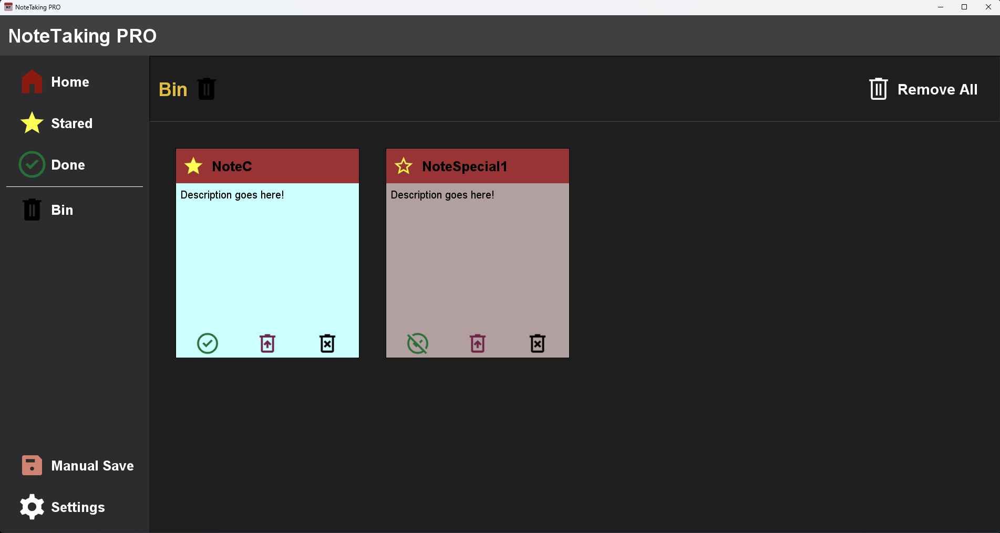

--------------
NoteTaking PRO
--------------

#Overview
A simple to-do application developed with Java Swing, offering a clean and minimalistic dark mode design. Created to learn and explore Java Swing for GUI development.

#Features
- Clean and Minimalistic Design: Welcoming and intuitive interface.
- Customizable Notes: Create and personalize notes according to your preferences.
- Organize Notes: Sort your notes either alphabetically or by the most recent modifications.
- Star Important Notes: Highlight important notes for easy access.
- Mark Notes as Done: Keep track of completed tasks or notes.
- Recycle Bin: Restore deleted notes with ease using the bin feature.
- Simple Settings: Configure settings effortlessly.
  
#Images

#How to install and test it
...

 

